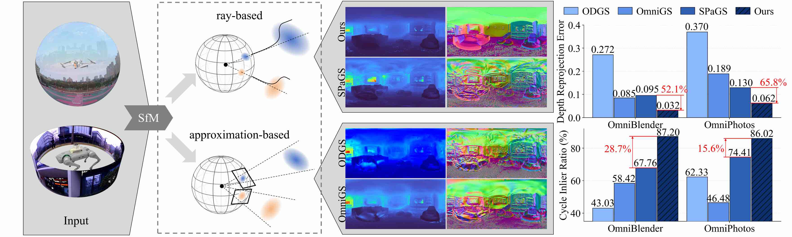

# Spherical-GOF
The official implementation of Spherical-GOF.

## Overview
Omnidirectional images are increasingly used in robotics and vision due to their wide field of view. However, extending 3D Gaussian Splatting (3DGS) to panoramic camera models remains challenging, as existing formulations are designed for perspective projections and naive adaptations often introduce distortion and geometric inconsistencies.

We present Spherical-GOF, an omnidirectional Gaussian rendering framework built upon Gaussian Opacity Fields (GOF). Unlike projection-based rasterization, Spherical-GOF performs GOF ray sampling directly on the unit sphere in spherical ray space, enabling consistent ray-Gaussian interactions for panoramic rendering. To make spherical ray casting efficient and robust, we derive a conservative spherical bounding rule for fast ray-Gaussian culling and introduce a spherical filtering scheme that adapts Gaussian footprints to distortion-varying panoramic pixel sampling.

Extensive experiments on standard panoramic benchmarks (OmniBlender and OmniPhotos) demonstrate competitive photometric quality and substantially improved geometric consistency. Compared with the strongest baseline, Spherical-GOF reduces depth reprojection error by 57% and improves cycle inlier ratio by 21%. Qualitative results show cleaner depth and more coherent normal maps, with strong robustness to global panorama rotations. We further validate generalization on OmniRob, a real-world robotic omnidirectional dataset introduced in this work, featuring UAV and quadruped platforms. The source code and the OmniRob dataset will be released.

## Demo

[demo video](https://github.com/user-attachments/assets/076f397a-464c-4991-b0fa-3b80c1ae299f)
