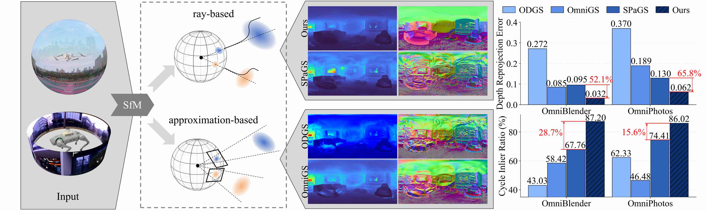

# Spherical-GOF

The official implementation of **Spherical-GOF**, an omnidirectional Gaussian
rendering framework built on [Gaussian Opacity Fields
(GOF)](https://github.com/autonomousvision/gaussian-opacity-fields).

<p align="center">
  Zhe Yang · Guoqiang Zhao · Sheng Wu · Kai Luo · Kailun Yang
</p>

<p align="center">
  <a href="https://arxiv.org/abs/2603.08503">Paper</a> |
  <a href="https://github.com/1170632760/Spherical-GOF">Code</a> |
  <a href="https://github.com/user-attachments/assets/076f397a-464c-4991-b0fa-3b80c1ae299f">Demo</a>
</p>

<p align="center">
  
</p>

## Overview

Spherical-GOF extends Gaussian Opacity Fields from perspective images to
equirectangular panoramas. Instead of applying a perspective approximation, it
performs GOF ray sampling directly in spherical ray space. The implementation
includes spherical Gaussian culling and filtering together with geometry-aware
regularization for panoramic reconstruction.

The code supports panoramic training, RGB and depth rendering, photometric
evaluation, Gaussian point-cloud export, and mesh extraction. The released
training defaults correspond to the final configuration used in our
experiments.

Experiments on OmniBlender and OmniPhotos show competitive photometric quality
and substantially improved geometric consistency. We also evaluate
generalization on OmniRob, a real-world omnidirectional dataset captured with
UAV and quadruped platforms.

## Demo

https://github.com/user-attachments/assets/076f397a-464c-4991-b0fa-3b80c1ae299f

## Installation

The code requires an NVIDIA GPU, PyTorch with CUDA support, and a CUDA toolkit
with `nvcc`. The following setup uses CUDA 11.8, which supports the native
compute capability (`sm_89`) of NVIDIA Ada GPUs such as the RTX 4090:

```bash
git clone https://github.com/1170632760/Spherical-GOF.git
cd Spherical-GOF

conda create -y -n gof python=3.8
conda activate gof

pip install torch==2.0.1+cu118 torchvision==0.15.2+cu118 \
    --index-url https://download.pytorch.org/whl/cu118
conda install -c nvidia cuda-toolkit=11.8

pip install -r requirements.txt
pip install submodules/diff-gaussian-rasterization
pip install submodules/simple-knn
```

Verify that both PyTorch and `nvcc` report CUDA 11.8 before compiling:

```bash
python -c "import torch; print(torch.__version__, torch.version.cuda)"
nvcc --version
```

Both CUDA extensions must be rebuilt after changing the PyTorch or CUDA
version. No manual `TORCH_CUDA_ARCH_LIST` setting is needed on an RTX 4090;
CUDA 11.8 detects and compiles for `sm_89` directly.

Mesh extraction additionally requires the tetrahedralization extension:

```bash
cd submodules/tetra-triangulation
conda install -c conda-forge cmake gmp cgal
cmake .
make -j4
pip install -e .
cd ../..
```

If CUDA is installed in a non-default location, set `CUDA_HOME` before building
the extensions.

## Repository Structure

The root directory contains only the primary method entry points:

```text
train.py                    # training
render.py                   # RGB and depth rendering
metrics.py                  # photometric evaluation
extract_mesh.py             # GOF mesh extraction
```

Dataset conversion, legacy GOF evaluation, visualization, and batch helpers are
organized under `scripts/`. CUDA/C++ extensions and their third-party
dependencies are kept under `submodules/`.

## Datasets

We evaluate on
[OmniBlender](https://github.com/changwoonchoi/EgoNeRF) and
[OmniPhotos](https://github.com/cr333/OmniPhotos). Each prepared scene should
have the following layout:

```text
scene/
├── images/
├── data_views.json
├── data_extrinsics.json
├── train.txt
├── test.txt
└── pcd.ply                  # optional initialization point cloud
```

`train.txt` and `test.txt` contain one image stem per line. When `pcd.ply` is
absent, the loader creates a random initialization point cloud on first use.
Pass `--eval` during training to preserve the test split; without it, test
images are merged into the training set.

The inherited COLMAP and NeRF-Synthetic loaders from GOF are also retained.

## Training

The default configuration trains for 8,000 iterations. For example:

```bash
CUDA_VISIBLE_DEVICES=0 OMP_NUM_THREADS=4 python train.py \
    -s /path/to/OmniBlender/archiviz-flat \
    -m output/omniblender/archiviz-flat \
    --eval \
    -r 1
```

Training is headless and uses CUDA. `-r 1` keeps the original panorama
resolution; larger values downsample the input by that factor.

## Rendering RGB and Depth

Render the held-out views from the latest saved iteration with:

```bash
CUDA_VISIBLE_DEVICES=0 python render.py \
    -m output/omniblender/archiviz-flat \
    --iteration -1 \
    --skip_train \
    --depth_global_norm
```

Depth export is enabled by default. For an 8,000-iteration model trained with
`-r 1`, the results are written to:

```text
output/omniblender/archiviz-flat/test/ours_8000/
├── test_preds_1/            # rendered RGB images
├── gt_1/                    # ground-truth RGB images
├── depth_vis_1/             # colorized depth maps
└── depth_raw_1/             # raw depth arrays and camera poses
```

Use `--no_save_depth` when only RGB output is needed.

## Evaluation

Compute PSNR, SSIM, and LPIPS for a rendered scene with:

```bash
CUDA_VISIBLE_DEVICES=0 python metrics.py \
    -m output/omniblender/archiviz-flat \
    -r 1
```

The aggregate and per-view results are saved as `results.json` and
`per_view.json` in the model directory.

## Mesh Extraction

After compiling the tetrahedralization extension, extract a textured mesh with:

```bash
CUDA_VISIBLE_DEVICES=0 python extract_mesh.py \
    -m output/omniblender/archiviz-flat \
    --iteration 8000 \
    --filter_mesh \
    --texture_mesh
```

With the default five binary-search steps, the final mesh is written to:

```text
output/omniblender/archiviz-flat/test/ours_8000/fusion/mesh_binary_search_4.ply
```

## Acknowledgements

Spherical-GOF is built on
[Gaussian Opacity Fields](https://github.com/autonomousvision/gaussian-opacity-fields)
and [3D Gaussian Splatting](https://github.com/graphdeco-inria/gaussian-splatting).
We thank the authors for making their work available.

## License

This repository contains code derived from GOF and 3D Gaussian Splatting. The
combined work is distributed for non-commercial research and evaluation under
the terms in [LICENSE.md](./LICENSE.md). Third-party components retain their
respective license and attribution files.

## Citation

If you find Spherical-GOF useful, please cite our paper:

```bibtex
@article{yang2026sphericalgof,
  title   = {Spherical-GOF: Geometry-Aware Panoramic Gaussian Opacity Fields for 3D Scene Reconstruction},
  author  = {Yang, Zhe and Zhao, Guoqiang and Wu, Sheng and Luo, Kai and Yang, Kailun},
  journal = {arXiv preprint arXiv:2603.08503},
  year    = {2026}
}
```

Spherical-GOF is built upon Gaussian Opacity Fields. Please also cite the
original GOF work:

```bibtex
@article{Yu2024GOF,
  author  = {Yu, Zehao and Sattler, Torsten and Geiger, Andreas},
  title   = {Gaussian Opacity Fields: Efficient Adaptive Surface Reconstruction in Unbounded Scenes},
  journal = {ACM Transactions on Graphics},
  year    = {2024}
}
```
